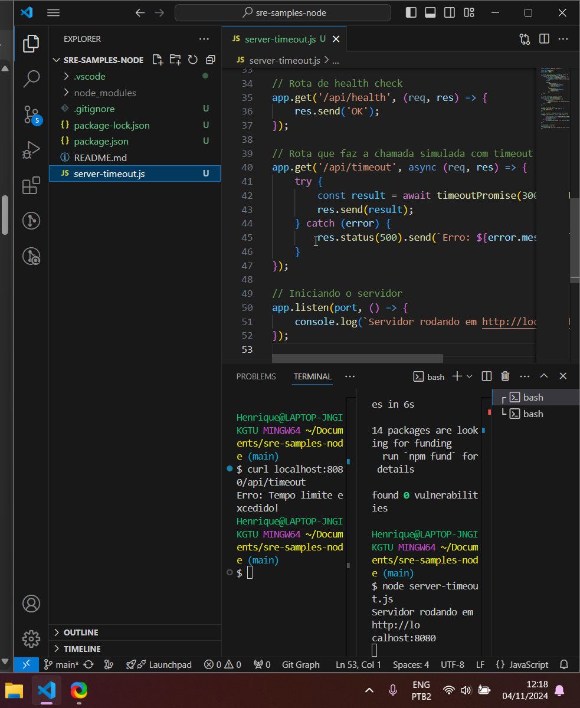
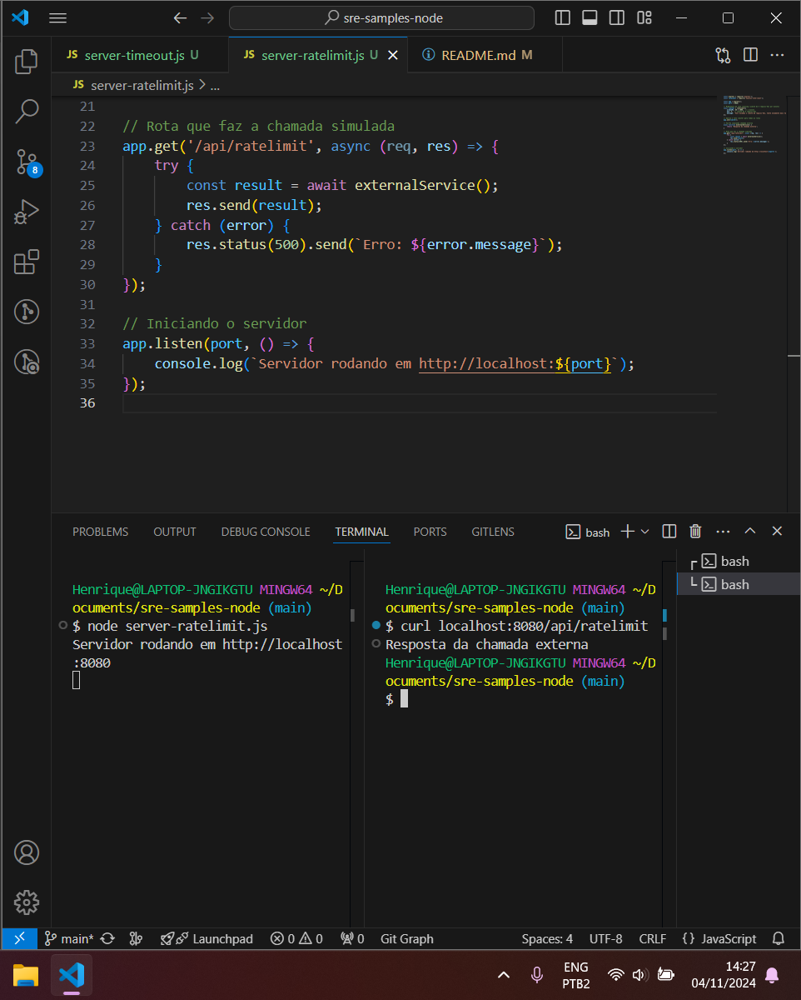
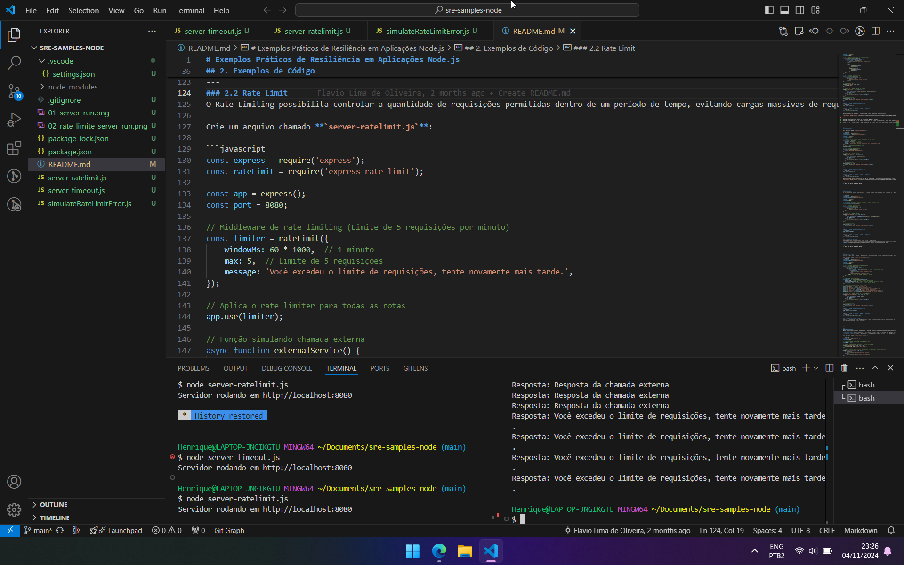
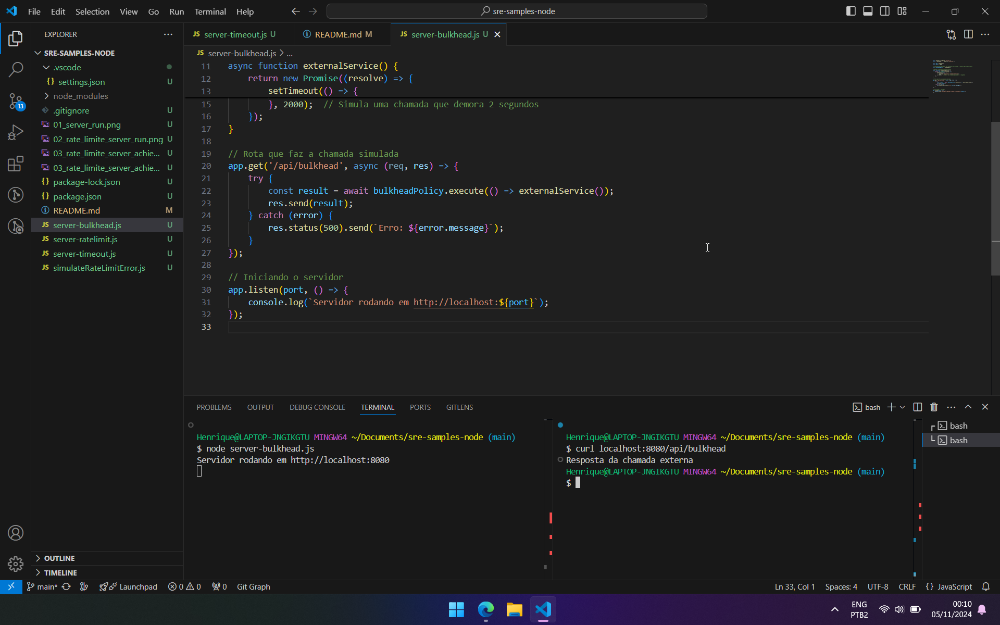
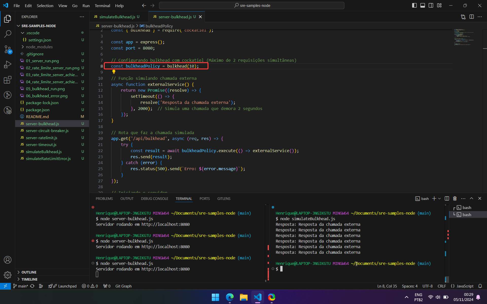
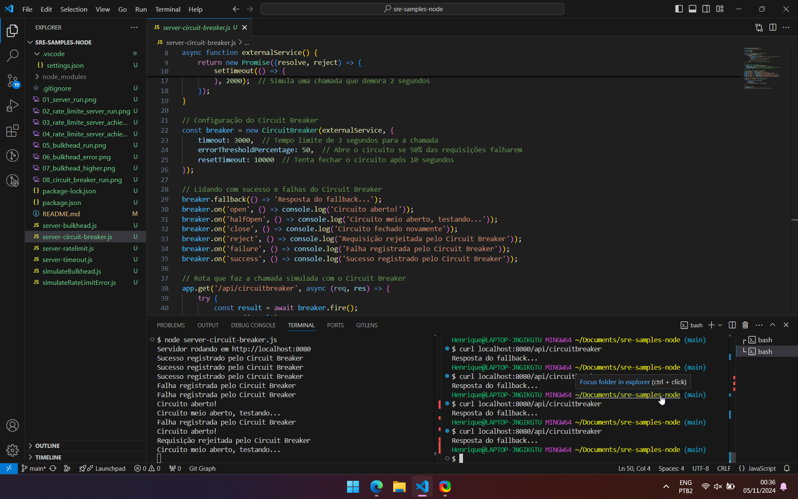

# Exemplos Práticos de Resiliência em Aplicações Node.js
Este material contempla exemplos práticos de uso de técnicas essenciais em aplicações, afim de garantir a confiabilidade, resiliência, escalabilidade e alta disponibilidade.

Dentre os temas tratados, são apresentados os seguintes itens chave:
- **Timeout**
- **Rate Limit**
- **Bulkhead**
- **Circuit Breaker**
- **Health Check**

Para demonstração foram utilizadas as Bibliotecas e Frameworks:

- `express`: Framework web para Node.js que facilita a criação de servidores e APIs. Usado para criar o servidor HTTP e rotas. Link: https://expressjs.com/

- `cockatiel`: Biblioteca que implementa padrões de resiliência, como timeout e bulkhead, para chamadas assíncronas. Link: https://www.npmjs.com/package/cockatiel
      
- `express-rate-limit`: Middleware para Express que limita o número de requisições de um IP específico em um determinado período. Usado para implementar rate limiting. Link: https://www.npmjs.com/package/express-rate-limit

- `opossum`: Biblioteca que implementa o padrão de Circuit Breaker, que ajuda a evitar chamadas a serviços que estão falhando. Permite definir limites de tempo, porcentagens de falhas e intervalos de reset. Link: https://github.com/nodeshift/opossum

## 1. Criar o Projeto Node.js

**1.1 Criar um diretório para o projeto e inicializar um novo projeto Node.js:**

 ```sh
 mkdir sre-samples-node
 cd sre-samples-node
 npm init -y
```
**1.2 Instalar as dependências necessárias:**

```
npm install express cockatiel express-rate-limit opossum
```

## 2. Exemplos de Código

### 2.1 Timeout
O papel principal das configurações de Timeout são definir um limite de tempo para a execução de operações, evitando erros inesperados e um tratamento adequado de serviços que tendem a demorar por conta de eventos não esperados. Este tipo de tratamento evita erros indesejados impactando a experiência do cliente.

Crie um arquivo chamado **`server-timeout.js`**:

```javascript
const express = require('express');

const app = express();
const port = 8080;

// Função para criar uma Promise que simula um timeout
function timeoutPromise(ms, promise) {
    return new Promise((resolve, reject) => {
        const timeout = setTimeout(() => {
            reject(new Error('Tempo limite excedido!'));
        }, ms);

        promise
            .then((result) => {
                clearTimeout(timeout);
                resolve(result);
            })
            .catch((error) => {
                clearTimeout(timeout);
                reject(error);
            });
    });
}

// Função simulando chamada externa
async function externalService() {
    return new Promise((resolve) => {
        setTimeout(() => {
            resolve('Resposta da chamada externa');
        }, 5000); 
    });
}

// Rota de health check
app.get('/api/health', (req, res) => {
    res.send('OK');
});

// Rota que faz a chamada simulada com timeout
app.get('/api/timeout', async (req, res) => {
    try {
        const result = await timeoutPromise(3000, externalService());
        res.send(result);
    } catch (error) {
        res.status(500).send(`Erro: ${error.message}`);
    }
});

// Iniciando o servidor
app.listen(port, () => {
    console.log(`Servidor rodando em http://localhost:${port}`);
});
```

**Utilize o comando para executar a aplicação**
```javascript
node server-timeout.js
```
 
**Utilize o comando pra realizar a chamada do endpoint**
```javascript
curl localhost:8080/api/timeout
```

#### 2.1.2 Desafio - Timeout
Ajustar configurações de timeout e corrigir erro de timeout execedido ao invocar o serviço


```

A função ``externalService`` retorna uma promise após 5000 ms (5 segundos)
A função `timeoutPromise` cria uma promise que retorna um erro `'Tempo limite excedido!'` caso o tempo de espera ultrapasse o tempo passado como parâmetro

Assim, para que o código funcione, o tempo passado como parâmetro na linha `const result = await timeoutPromise(5500, externalService());` (linha 42) deve ser superior ao tempo de timeout da função `externalService`. Ou seja, o parâmetro passado deve ser maior que 5000.

```



---
### 2.2 Rate Limit
O Rate Limiting possibilita controlar a quantidade de requisições permitidas dentro de um período de tempo, evitando cargas massivas de requisições mal intensionadas, por exemplo.

Crie um arquivo chamado **`server-ratelimit.js`**:

```javascript
const express = require('express');
const rateLimit = require('express-rate-limit');

const app = express();
const port = 8080;

// Middleware de rate limiting (Limite de 5 requisições por minuto)
const limiter = rateLimit({
    windowMs: 60 * 1000,  // 1 minuto
    max: 5,  // Limite de 5 requisições
    message: 'Você excedeu o limite de requisições, tente novamente mais tarde.',
});

// Aplica o rate limiter para todas as rotas
app.use(limiter);

// Função simulando chamada externa
async function externalService() {
    return 'Resposta da chamada externa';
}

// Rota que faz a chamada simulada
app.get('/api/ratelimit', async (req, res) => {
    try {
        const result = await externalService();
        res.send(result);
    } catch (error) {
        res.status(500).send(`Erro: ${error.message}`);
    }
});

// Iniciando o servidor
app.listen(port, () => {
    console.log(`Servidor rodando em http://localhost:${port}`);
});

```

**Utilize o comando para executar a aplicação**
```javascript
node server-ratelimit.js
```
 
**Utilize o comando pra realizar a chamada do endpoint**
```javascript
curl localhost:8080/api/ratelimit
```
#### 2.1.2 Desafio - Rate Limit
Alterar limite de requisições permitidas para 100 num intervalo de 1 minuto e escrever uma função para simular o erro de Rate Limit.


```
Foi feita uma função no arquivo `simulateRateLimitError`

Essa função tem um laço for que faz uma chamada repetida ao endpoint a fim de estourar o rate limit

A quantidade de chamadas é representada pelo parâmetro max que foi definido em 100, assim como no arquivo `server-ratelimit`
```





---
### 2.3 Bulkhead
As configurações de Bulkhead permitem limitar o número de chamadas simultâneas a um serviço, de modo que a aplicação sempre esteja preparada para cenários adversos.

Crie um arquivo chamado **`server-bulkhead.js`**:

```javascript
const express = require('express');
const { bulkhead } = require('cockatiel');

const app = express();
const port = 8080;

// Configurando bulkhead com cockatiel (Máximo de 2 requisições simultâneas)
const bulkheadPolicy = bulkhead(2);

// Função simulando chamada externa
async function externalService() {
    return new Promise((resolve) => {
        setTimeout(() => {
            resolve('Resposta da chamada externa');
        }, 2000);  // Simula uma chamada que demora 2 segundos
    });
}

// Rota que faz a chamada simulada
app.get('/api/bulkhead', async (req, res) => {
    try {
        const result = await bulkheadPolicy.execute(() => externalService());
        res.send(result);
    } catch (error) {
        res.status(500).send(`Erro: ${error.message}`);
    }
});

// Iniciando o servidor
app.listen(port, () => {
    console.log(`Servidor rodando em http://localhost:${port}`);
});

```

**Utilize o comando para executar a aplicação**
```javascript
node server-bulkhead.js
```
 
**Utilize o comando pra realizar a chamada do endpoint**
```javascript
curl localhost:8080/api/bulkhead
```

#### 2.3.2 Desafio - Bulkhead
Aumentar quantidade de chamadas simultâneas e avaliar o comportamento.


**BÔNUS**: implementar método que utilizando threads para realizar as chamadas e logar na tela 


```
Aumentar o parâmetro do bulkhead() faz com que mais conexões sejam permitidas ao mesmo tempo

É importante calibrar corretamente esse valor afim de evitar ataques DDOS e utilizar dos balanceadores de carga.
```





---
### 2.4 Circuit Breaker
O Circuit Breaker ajuda a proteger a aplicação contra falhas em cascata, evitando chamadas excessivas para serviços que estão falhando.

Crie um arquivo chamado **`server-circuit-breaker.js`**:

```javascript
const express = require('express');
const CircuitBreaker = require('opossum');

const app = express();
const port = 8080;

// Função simulando chamada externa com 50% de falhas
async function externalService() {
    return new Promise((resolve, reject) => {
        setTimeout(() => {
            const shouldFail = Math.random() > 0.8;  // Simula o percentual de falhas
            if (shouldFail) {
                reject(new Error('Falha na chamada externa'));
            } else {
                resolve('Resposta da chamada externa');
            }
        }, 2000);  // Simula uma chamada que demora 2 segundos
    });
}

// Configuração do Circuit Breaker
const breaker = new CircuitBreaker(externalService, {
    timeout: 3000,  // Tempo limite de 3 segundos para a chamada
    errorThresholdPercentage: 50,  // Abre o circuito se 50% das requisições falharem
    resetTimeout: 10000  // Tenta fechar o circuito após 10 segundos
});

// Lidando com sucesso e falhas do Circuit Breaker
breaker.fallback(() => 'Resposta do fallback...');
breaker.on('open', () => console.log('Circuito aberto!'));
breaker.on('halfOpen', () => console.log('Circuito meio aberto, testando...'));
breaker.on('close', () => console.log('Circuito fechado novamente'));
breaker.on('reject', () => console.log('Requisição rejeitada pelo Circuit Breaker'));
breaker.on('failure', () => console.log('Falha registrada pelo Circuit Breaker'));
breaker.on('success', () => console.log('Sucesso registrado pelo Circuit Breaker'));

// Rota que faz a chamada simulada com o Circuit Breaker
app.get('/api/circuitbreaker', async (req, res) => {
    try {
        const result = await breaker.fire();
        res.send(result);
    } catch (error) {
        res.status(500).send(`Erro: ${error.message}`);
    }
});

// Iniciando o servidor
app.listen(port, () => {
    console.log(`Servidor rodando em http://localhost:${port}`);
});
```

**Utilize o comando para executar a aplicação**
```javascript
node server-circuit-breaker.js
```
 
**Utilize o comando pra realizar a chamada do endpoint**
```javascript
curl localhost:8080/api/circuitbreaker
```

#### 2.4.1 Desafio - Circuit Breaker
Ajustar o o percentual de falhas para que o circuit breaker obtenha sucesso ao receber as requisições após sua abertura.
Observar comportamento do circuito no console.

```
A função externalService() simula a chamada de um serviço externo que tem um tempo de resposta de 2000ms (2 segundos) e 20% de chance de falha

As outras funções são para definir rota e configurar o Circuit Breaker

Ajustar o Circuit Breaker para que obtenha chance de abrir significa alterar o parâmetro shouldFail da função externalService(), esse parâmetro foi modificado de 0.8 para 0.5.

Isso significa que a taxa de falha foi de 20% para 50%.

```



---
### 2.5 Health Check
Health check é uma prática comum para monitorar o status de uma aplicação e garantir que esteja funcionando corretamente.

- **Liveness Probe**: Verifica se a aplicação está rodando. Geralmente usado para verificar se a aplicação está ativa e não travada.
- **Readiness Probe**: Verifica se a aplicação está pronta para aceitar requisições. Isso é útil para garantir que o serviço está pronto para receber tráfego.

Crie um arquivo chamado **`server-health-check.js`**:

```javascript
const express = require('express');
const app = express();
const port = 8080;

// Simulando o estado da aplicação para o Readiness Check
let isReady = false;

// Endpoint Liveness Check - verifica se o servidor está rodando
app.get('/health/liveness', (req, res) => {
    res.status(200).send('Liveness check passed');
});

// Endpoint Readiness Check - verifica se a aplicação está pronta para receber requisições
app.get('/health/readiness', (req, res) => {
    if (isReady) {
        res.status(200).send('Readiness check passed');
    } else {
        res.status(503).send('Service is not ready yet');
    }
});

// Endpoint para simular a aplicação ficando pronta
app.get('/make-ready', (req, res) => {
    isReady = true;
    res.send('Application is now ready to accept requests');
});

// Iniciando o servidor
app.listen(port, () => {
    console.log(`Servidor rodando na porta ${port}`);
});

```

**Utilize o comando para executar a aplicação**
```javascript
node server-health-check.js
```

**Definição endpoints criados**
- Liveness (`/health/liveness`): Este endpoint sempre retorna um status HTTP 200 para indicar que o serviço está vivo e em execução.
- Readiness (`/health/readiness`): Este endpoint retorna um status HTTP 200 apenas se a variável isReady estiver definida como true. Caso contrário, retorna um status HTTP 503 para indicar que o serviço não está pronto para receber tráfego.
- Simulação de Readiness (`/make-ready`): Esse endpoint permite que a aplicação altere seu estado para "pronta", configurando o isReady como true.
 
Em seguida, para entendimento detalhado, execute os comandos abaixo em ordem:

**1. Liveness**
```sh
curl http://localhost:8080/health/liveness
```

**2. Liveness output**
```sh
Liveness check passed
```

**3. Readiness**
```sh
curl http://localhost:8080/health/readiness
```

**4. Readiness output**
```sh
Service is not ready yet
```

**5. Simulação de Readiness**
```sh
curl http://localhost:8080/make-ready
```
**6. Readiness**
```sh
curl http://localhost:8080/health/readiness
```
**7. Readiness output**
```sh
Readiness check passed
```


#### 2.5.1 Exemplo de configuração de Probes no Kubernetes (Opcional)
Para utilizar esses endpoints como probes no Kubernetes, você pode configurar o `deployment.yaml` da seguinte maneira:

```yaml
apiVersion: apps/v1
kind: Deployment
metadata:
  name: node-app
spec:
  replicas: 2
  selector:
    matchLabels:
      app: node-app
  template:
    metadata:
      labels:
        app: node-app
    spec:
      containers:
      - name: node-app
        image: your-node-app-image
        ports:
        - containerPort: 8080
        livenessProbe:
          httpGet:
            path: /health/liveness
            port: 8080
          initialDelaySeconds: 3
          periodSeconds: 5
        readinessProbe:
          httpGet:
            path: /health/readiness
            port: 8080
          initialDelaySeconds: 5
          periodSeconds: 10

```
**Probes no Kubernetes:**
- **livenessProbe**: O Kubernetes faz uma requisição GET para o endpoint `/health/liveness`. Se retornar um código de status 200, o container é considerado vivo. Se falhar repetidamente, o container será reiniciado.
- **readinessProbe**: O Kubernetes faz uma requisição GET para o endpoint `/health/readiness`. O container é considerado pronto se retornar 200. Se falhar, o container será removido das rotas de serviço até que esteja pronto novamente.

**Propriedades das Probes**
- `httpGet`: Realiza uma requisição HTTP.
- `path`: O caminho do endpoint HTTP que será verificado (por exemplo, /health/liveness).
- `port`: A porta do container onde a requisição será feita.
- `initialDelaySeconds`: O tempo de espera antes do primeiro check ser executado.
- `periodSeconds`: A frequência de execução do check.
- `failureThreshold`: Quantas falhas consecutivas são necessárias para reiniciar o container.
- `successThreshold`: Número de sucessos consecutivos necessários para marcar o container como pronto.
- `timeoutSeconds`: Tempo máximo de espera antes de considerar o check como falha.

Para saber mais, acesse:
- https://kubernetes.io/docs/tasks/configure-pod-container/configure-liveness-readiness-startup-probes/
- https://kubernetes.io/docs/concepts/configuration/liveness-readiness-startup-probes/
